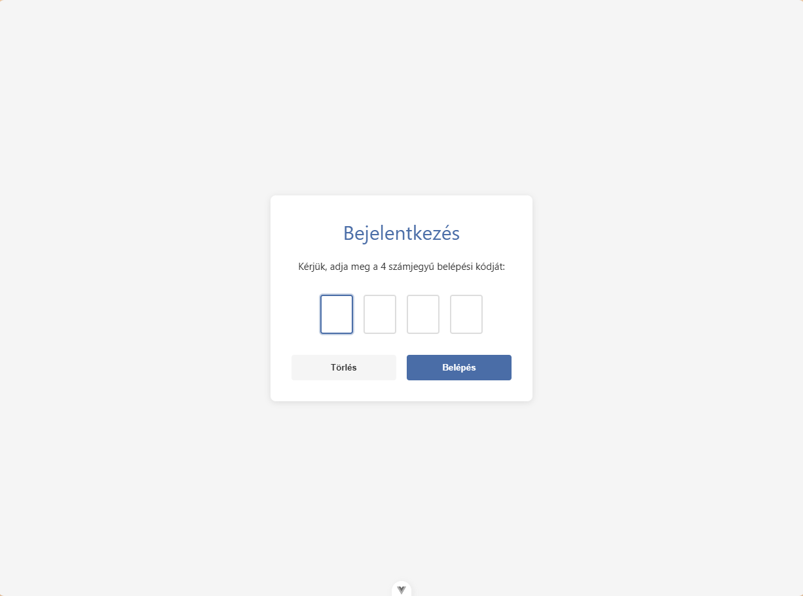
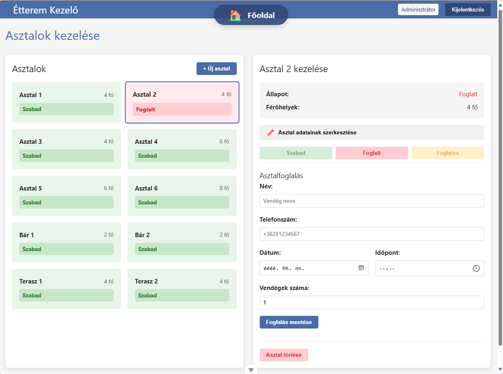

# Étterem Alkalmazás

Ez az alkalmazás egy étterem kezelő rendszer, amely lehetővé teszi az asztalok, rendelések, menük és foglalások kezelését.

## Képernyőképek a projektről







## Előfeltételek
- Git
- NodeJS
- CoucheDB (simán a C meghajtóra mehet)

## Telepítés és futtatás

1. Klónozd le a repository-t:
   ```
   git clone <repository-url>
   cd etterem
   ```

2. Telepítsd a függőségeket:
   ```
   npm install
   ```

3. Hozd létre a `.env` fájlt a `.env.example` alapján:
   ```
   cp .env.example .env
   ```

4. Indítsd el a CouchDB szervert és az API szervert:
   ```
   npm run start
   ```
   Ez a parancs elindítja a Docker Compose környezetet a CouchDB-vel és az Express szervert, amely közvetít a CouchDB és a böngésző között.

5. Inicializáld az adatbázist (csak az első indításkor szükséges):
   ```
   npm run db:init
   ```

6. Fejlesztői módban való futtatáshoz nyiss egy új terminált és futtasd:
   ```
   npm run dev
   ```

7. Nyisd meg a böngészőben: http://localhost:5173

## Adatbázis kezelés

- CouchDB admin felület: http://localhost:5984/_utils
  - Felhasználónév: admin (vagy amit a .env fájlban beállítottál)
  - Jelszó: password (vagy amit a .env fájlban beállítottál)

- CouchDB leállítása:
  ```
  npm run db:stop
  ```

## Adatbázis struktúra

Az alkalmazás CouchDB-t használ adatbázisként. A következő adatbázisok kerülnek létrehozásra:

### 1. restaurant_menu
A menü elemek és kategóriák tárolására szolgál.

**Dokumentum típusok:**
- **category**: Menü kategóriák (pl. pizzák, italok, desszertek)
  - Fontos mezők: `_id`, `name`, `order`, `type: "category"`
- **menuItem**: Menü elemek (pl. egyes ételek, italok)
  - Fontos mezők: `_id`, `name`, `price`, `description`, `category` (kategória ID), `type: "menuItem"`, `ingredients`, `allergens`, `image`

### 2. restaurant_tables
Az asztalok és azok állapotának tárolására szolgál.

**Dokumentum típusok:**
- **table**: Asztalok adatai
  - Fontos mezők: `_id`, `name`, `seats` (férőhelyek száma), `status` (szabad, foglalt, stb.), `type: "table"`, `order` (sorrend), `location` (elhelyezkedés)

### 3. restaurant_orders
A rendelések tárolására szolgál.

**Dokumentum típusok:**
- **order**: Rendelések adatai
  - Fontos mezők: `_id`, `tableId` (helyi rendelésnél), `status` (új, folyamatban, kész, stb.), `items` (rendelt tételek), `createdAt`, `updatedAt`, `type` (local, delivery, takeaway), `name`, `phone`, `address` (kiszállításnál)

### 4. restaurant_invoices
A számlák tárolására szolgál.

**Dokumentum típusok:**
- **invoice**: Számlák adatai
  - Fontos mezők: `_id`, `orderId`, `tableId`, `items`, `total`, `paymentMethod`, `createdAt`, `taxAmount`, `customerInfo`

### 5. restaurant_settings
Az alkalmazás beállításainak tárolására szolgál.

**Dokumentum típusok:**
- **settings**: Alkalmazás beállítások
  - Fontos mezők: `_id: "settings"`, `restaurantName`, `address`, `phone`, `email`, `taxNumber`, `deliveryFee`, `packagingFee`, `minOrderAmount`, `openingHours`, `paymentMethods`

### 6. restaurant_reservations
Asztalfoglalások tárolására szolgál.

**Dokumentum típusok:**
- **reservation**: Foglalások adatai
  - Fontos mezők: `_id`, `tableId`, `customerName`, `customerPhone`, `date`, `time`, `duration`, `persons`, `status`, `notes`

### 7. restaurant_customers
Ügyfelek adatainak tárolására szolgál.

**Dokumentum típusok:**
- **customer**: Ügyfelek adatai
  - Fontos mezők: `_id`, `name`, `phone`, `address`, `notes`, `type: "customer"`, `firstOrderDate`, `lastOrderDate`
- **_design/customers**: Design dokumentum a view-k számára
  - Views: `by_phone`, `by_name`

## CouchDB Views

Az alkalmazás a következő CouchDB view-kat használja a hatékony lekérdezésekhez:

### restaurant_customers adatbázis
- **_design/customers/by_phone**: Ügyfelek lekérdezése telefonszám alapján
  - Map függvény: `function (doc) { if (doc.type === "customer") { emit(doc.phone, doc); } }`
- **_design/customers/by_name**: Ügyfelek lekérdezése név alapján
  - Map függvény: `function (doc) { if (doc.type === "customer") { emit(doc.name, doc); } }`

## API végpontok

Az alkalmazás a következő API végpontokat biztosítja:

- `GET /api/{database}` - Az összes dokumentum lekérése az adott adatbázisból
- `GET /api/{database}/{id}` - Egy dokumentum lekérése ID alapján
- `POST /api/{database}` - Új dokumentum létrehozása vagy meglévő frissítése
- `DELETE /api/{database}/{id}` - Dokumentum törlése
- `POST /api/{database}/_find` - Keresés az adatbázisban

Ahol a `{database}` lehet:
- `restaurant_menu`
- `restaurant_tables`
- `restaurant_orders`
- `restaurant_invoices`
- `restaurant_settings`
- `restaurant_reservations`
- `restaurant_customers`

## Adatbázis futtatása Docker Compose-szal

A projekt Docker Compose-t használ a CouchDB adatbázis futtatásához. Ehhez szükséged lesz a Docker és Docker Compose telepítésére.

1. Telepítsd a Docker-t és a Docker Compose-t:
   - [Docker telepítési útmutató](https://docs.docker.com/get-docker/)
   - [Docker Compose telepítési útmutató](https://docs.docker.com/compose/install/)

2. Indítsd el a CouchDB konténert:
```
docker-compose up -d
```

3. Ellenőrizd, hogy fut-e a konténer:
```
docker-compose ps
```

4. A CouchDB admin felülete elérhető a következő címen:
```
http://localhost:5984/_utils
```
   - Felhasználónév: admin
   - Jelszó: password

5. A konténer leállítása:
```
docker-compose down
```

### Alternatív telepítés (Docker nélkül)

Ha nem szeretnéd Docker-rel futtatni az adatbázist, telepítheted közvetlenül a CouchDB-t:

#### Windows
- Töltsd le a CouchDB telepítőt a [hivatalos oldalról](https://couchdb.apache.org/#download)
- Futtasd a telepítőt és kövesd az utasításokat
- Alapértelmezetten a CouchDB a http://localhost:5984 címen lesz elérhető

#### macOS
```
brew install couchdb
brew services start couchdb
```

#### Linux (Ubuntu/Debian)
```
sudo apt-get update
sudo apt-get install -y couchdb
sudo systemctl start couchdb
```

Ebben az esetben frissítsd a `src/services/couchdb-setup.js` fájlt a megfelelő URL-lel és hitelesítési adatokkal.

## Fejlesztés

Fejlesztői szerver indítása:
```
npm run dev
```

## Építés

Alkalmazás építése:
```
npm run build
```

## Technológiák

- Vue.js 3
- Pinia (állapotkezelés)
- Vue Router
- CouchDB (adatbázis)
- Vite (build eszköz)
- Docker & Docker Compose (konténerizáció)

## Recommended IDE Setup

[VSCode](https://code.visualstudio.com/) + [Volar](https://marketplace.visualstudio.com/items?itemName=Vue.volar) (and disable Vetur).

## Customize configuration

See [Vite Configuration Reference](https://vite.dev/config/).

## Project Setup

```sh
npm install
```

### Compile and Hot-Reload for Development

```sh
npm run dev
```

### Compile and Minify for Production

```sh
npm run build
```

## Projekt struktúra

A projekt a következő könyvtárszerkezettel rendelkezik:

```
etterem/
├── .git/                  # Git repository
├── .vscode/               # VS Code beállítások
├── dist/                  # Fordított alkalmazás (npm run build után)
├── images/                # Képernyőképek és egyéb képek
├── node_modules/          # Telepített npm csomagok
├── public/                # Statikus fájlok
├── src/                   # Forráskód
│   ├── assets/            # Statikus erőforrások (képek, stílusok)
│   ├── components/        # Újrafelhasználható Vue komponensek
│   ├── router/            # Vue Router konfiguráció
│   ├── services/          # Szolgáltatások (API, adatbázis)
│   ├── stores/            # Pinia állapotkezelő tárolók
│   ├── views/             # Oldal nézetek (Vue komponensek)
│   ├── App.vue            # Fő alkalmazás komponens
│   ├── main.js            # Alkalmazás belépési pont
│   └── polyfill.js        # Polyfill-ek régebbi böngészőkhöz
├── .env                   # Környezeti változók (nem verziókezelt)
├── .env.example           # Környezeti változók példa
├── .gitignore             # Git által figyelmen kívül hagyott fájlok
├── db-cleanup.js          # Adatbázis tisztító szkript
├── db-seed.js             # Adatbázis feltöltő szkript
├── db-seed-burgers.js     # Hamburger adatok feltöltése
├── db-seed-pizzas.js      # Pizza adatok feltöltése
├── db-seed-salads.js      # Saláta adatok feltöltése
├── db-setup.js            # Adatbázis inicializáló szkript
├── docker-compose.yml     # Docker Compose konfiguráció
├── index.html             # HTML belépési pont
├── jsconfig.json          # JavaScript konfiguráció
├── package.json           # NPM csomag konfiguráció
├── package-lock.json      # NPM függőségek zárolása
├── README.md              # Projekt dokumentáció
├── server.js              # Express API szerver
├── start-app.bat          # Windows indító szkript
├── update-app.bat         # Windows frissítő szkript
└── vite.config.js         # Vite konfiguráció
```

## Komponensek és nézetek

### Fő nézetek (src/views/)

- **HomeView.vue**: Kezdőoldal, amely áttekintést nyújt az alkalmazás fő funkcióiról és a jelenlegi állapotról.
- **OrdersView.vue**: Rendelések kezelése, új rendelések felvétele, meglévők módosítása, rendelési állapotok követése.
- **TablesView.vue**: Asztalok kezelése, asztalok állapotának megjelenítése, asztalok hozzárendelése rendelésekhez.
- **MenuView.vue**: Étlap kezelése, ételek és italok hozzáadása, módosítása, kategóriák kezelése.
- **BillingView.vue**: Számlázás, fizetési műveletek kezelése, számlák és nyugták generálása.
- **SettingsView.vue**: Alkalmazás beállításai, étterem adatai, felhasználói beállítások.
- **CustomersView.vue**: Ügyfelek kezelése, törzsvendégek adatainak tárolása, keresés ügyfelek között.

### Szolgáltatások (src/services/)

- **couchdb-service.js**: CouchDB adatbázis műveletek kezelése, dokumentumok lekérdezése, módosítása.
- **db.js**: Adatbázis kapcsolat és műveletek absztrakciója.
- **tableService.js**: Asztalok kezelésével kapcsolatos szolgáltatások.
- **couchdb-setup.js**: CouchDB kapcsolat beállítása.
- **pouchdb-setup.js**: PouchDB kliens oldali adatbázis beállítása.

### Router (src/router/)

- **index.js**: Az alkalmazás útvonalkezelője, amely definiálja az elérhető oldalakat és azok komponenseit.

## Seed adatok

Az alkalmazás tartalmaz előre definiált adatokat, amelyeket a fejlesztés vagy tesztelés során lehet betölteni az adatbázisba. Ezek a következő szkriptekkel tölthetők be:

- **db-seed.js**: Általános seed adatok betöltése (minden kategória).
- **db-seed-burgers.js**: Hamburger adatok betöltése a menübe.
- **db-seed-pizzas.js**: Pizza adatok betöltése a menübe.
- **db-seed-salads.js**: Saláta adatok betöltése a menübe.

A seed adatok betöltéséhez használd a következő parancsokat:

```
# Minden seed adat betöltése
npm run db:seed

# Csak hamburgerek betöltése
npm run db:seed:burgers

# Csak pizzák betöltése
npm run db:seed:pizzas

# Csak saláták betöltése
npm run db:seed:salads
```

## Környezeti változók

Az alkalmazás a következő környezeti változókat használja, amelyeket a `.env` fájlban kell megadni:

| Változó | Leírás | Alapértelmezett érték |
|---------|--------|------------------------|
| VITE_COUCHDB_USER | CouchDB felhasználónév | admin |
| VITE_COUCHDB_PASSWORD | CouchDB jelszó | password |
| VITE_COUCHDB_URL | CouchDB URL | http://localhost:5984 |
| VITE_COUCHDB_PORT | CouchDB port | 5984 |
| VITE_API_URL | API szerver URL | http://localhost:3000/api |
| PORT | Express szerver port | 3000 |

## Hibaelhárítás

### Gyakori problémák és megoldásaik

#### 1. CouchDB kapcsolódási hiba

**Probléma**: Az alkalmazás nem tud kapcsolódni a CouchDB-hez.

**Megoldás**:
- Ellenőrizd, hogy a Docker konténer fut-e: `docker-compose ps`
- Ellenőrizd a CouchDB logokat: `docker-compose logs couchdb`
- Ellenőrizd a `.env` fájlban megadott kapcsolódási adatokat
- Próbáld meg újraindítani a CouchDB-t: `npm run db:stop && npm run db:start`

#### 2. Adatbázis inicializálási hiba

**Probléma**: Az adatbázis inicializálása sikertelen.

**Megoldás**:
- Ellenőrizd, hogy a CouchDB fut-e és elérhető
- Próbáld meg törölni és újra létrehozni az adatbázisokat: `npm run db:reset`
- Ellenőrizd a jogosultságokat a CouchDB admin felületén

#### 3. API szerver hiba

**Probléma**: Az API szerver nem indul el vagy nem válaszol.

**Megoldás**:
- Ellenőrizd a szerver logokat
- Ellenőrizd, hogy a PORT környezeti változó nem ütközik-e más alkalmazással
- Újraindítás: `node server.js`

#### 4. Fejlesztői szerver hiba

**Probléma**: A Vite fejlesztői szerver nem indul el.

**Megoldás**:
- Ellenőrizd, hogy nincs-e már futó példány a megadott porton
- Próbáld meg törölni a node_modules mappát és újratelepíteni a függőségeket: `rm -rf node_modules && npm install`
- Ellenőrizd a Vite konfigurációt a vite.config.js fájlban

## Tesztelés

Az alkalmazás jelenleg nem tartalmaz automatizált teszteket. A manuális teszteléshez kövesd az alábbi lépéseket:

1. Indítsd el az alkalmazást fejlesztői módban: `npm run dev`
2. Nyisd meg a böngészőben: http://localhost:5173
3. Teszteld a különböző funkciókat:
   - Asztalok kezelése
   - Rendelések felvétele és módosítása
   - Menü elemek kezelése
   - Számlázás
   - Beállítások módosítása
   - Ügyfelek kezelése

## Verziókezelés és hozzájárulás

A projekt Git verziókezelést használ. Ha hozzá szeretnél járulni a projekthez, kövesd az alábbi lépéseket:

1. Készíts egy fork-ot a repository-ból
2. Klónozd le a saját fork-odat: `git clone <your-fork-url>`
3. Hozz létre egy új ágat a fejlesztéshez: `git checkout -b feature/my-new-feature`
4. Végezd el a módosításokat
5. Commitold a változtatásokat: `git commit -am 'Add some feature'`
6. Pushold az ágat: `git push origin feature/my-new-feature`
7. Nyiss egy Pull Request-et

### Kódolási konvenciók

- Használj következetes behúzást (2 szóköz)
- Komponensek nevei PascalCase formátumban (pl. TableView.vue)
- Változók és függvények camelCase formátumban
- Kommentezd a kódot, különösen a bonyolultabb részeket
- Kövesd a Vue.js stílus útmutatót: https://vuejs.org/style-guide/

## Teljesítmény optimalizálás

Az alkalmazás teljesítményének optimalizálásához a következő technikákat alkalmaztuk:

1. Lusta betöltés (lazy loading) a Vue Router-ben a nagyobb komponensekhez
2. Komponensek újrafelhasználása a kód duplikáció elkerülése érdekében
3. CouchDB indexek és view-k használata a gyors lekérdezésekhez
4. Képek optimalizálása a gyorsabb betöltés érdekében