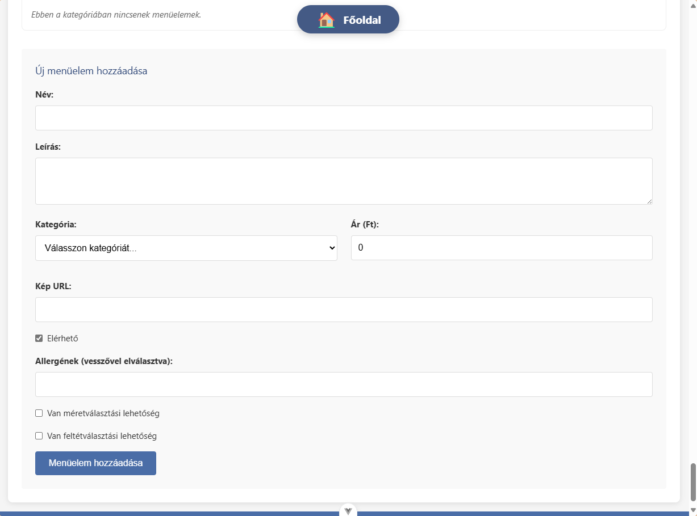

# Étterem Alkalmazás

Ez az alkalmazás egy étterem kezelő rendszer, amely lehetővé teszi az asztalok, rendelések, menük és foglalások kezelését.

## Képernyőképek a projektről




## Telepítés és futtatás

1. Klónozd le a repository-t:
   ```
   git clone <repository-url>
   cd etterem
   ```

2. Telepítsd a függőségeket:
   ```
   npm install
   ```

3. Hozd létre a `.env` fájlt a `.env.example` alapján:
   ```
   cp .env.example .env
   ```

4. Indítsd el a CouchDB szervert és az API szervert:
   ```
   npm run start
   ```
   Ez a parancs elindítja a Docker Compose környezetet a CouchDB-vel és az Express szervert, amely közvetít a CouchDB és a böngésző között.

5. Inicializáld az adatbázist (csak az első indításkor szükséges):
   ```
   npm run db:init
   ```

6. Fejlesztői módban való futtatáshoz nyiss egy új terminált és futtasd:
   ```
   npm run dev
   ```

7. Nyisd meg a böngészőben: http://localhost:5173

## Adatbázis kezelés

- CouchDB admin felület: http://localhost:5984/_utils
  - Felhasználónév: admin (vagy amit a .env fájlban beállítottál)
  - Jelszó: password (vagy amit a .env fájlban beállítottál)

- CouchDB leállítása:
  ```
  npm run db:stop
  ```

## Adatbázis struktúra

Az alkalmazás CouchDB-t használ adatbázisként. A következő adatbázisok kerülnek létrehozásra:

### 1. restaurant_menu
A menü elemek és kategóriák tárolására szolgál.

**Dokumentum típusok:**
- **category**: Menü kategóriák (pl. pizzák, italok, desszertek)
  - Fontos mezők: `_id`, `name`, `order`, `type: "category"`
- **menuItem**: Menü elemek (pl. egyes ételek, italok)
  - Fontos mezők: `_id`, `name`, `price`, `description`, `category` (kategória ID), `type: "menuItem"`, `ingredients`, `allergens`, `image`

### 2. restaurant_tables
Az asztalok és azok állapotának tárolására szolgál.

**Dokumentum típusok:**
- **table**: Asztalok adatai
  - Fontos mezők: `_id`, `name`, `seats` (férőhelyek száma), `status` (szabad, foglalt, stb.), `type: "table"`, `order` (sorrend), `location` (elhelyezkedés)

### 3. restaurant_orders
A rendelések tárolására szolgál.

**Dokumentum típusok:**
- **order**: Rendelések adatai
  - Fontos mezők: `_id`, `tableId` (helyi rendelésnél), `status` (új, folyamatban, kész, stb.), `items` (rendelt tételek), `createdAt`, `updatedAt`, `type` (local, delivery, takeaway), `name`, `phone`, `address` (kiszállításnál)

### 4. restaurant_invoices
A számlák tárolására szolgál.

**Dokumentum típusok:**
- **invoice**: Számlák adatai
  - Fontos mezők: `_id`, `orderId`, `tableId`, `items`, `total`, `paymentMethod`, `createdAt`, `taxAmount`, `customerInfo`

### 5. restaurant_settings
Az alkalmazás beállításainak tárolására szolgál.

**Dokumentum típusok:**
- **settings**: Alkalmazás beállítások
  - Fontos mezők: `_id: "settings"`, `restaurantName`, `address`, `phone`, `email`, `taxNumber`, `deliveryFee`, `packagingFee`, `minOrderAmount`, `openingHours`, `paymentMethods`

### 6. restaurant_reservations
Asztalfoglalások tárolására szolgál.

**Dokumentum típusok:**
- **reservation**: Foglalások adatai
  - Fontos mezők: `_id`, `tableId`, `customerName`, `customerPhone`, `date`, `time`, `duration`, `persons`, `status`, `notes`

### 7. restaurant_customers
Ügyfelek adatainak tárolására szolgál.

**Dokumentum típusok:**
- **customer**: Ügyfelek adatai
  - Fontos mezők: `_id`, `name`, `phone`, `address`, `notes`, `type: "customer"`, `firstOrderDate`, `lastOrderDate`
- **_design/customers**: Design dokumentum a view-k számára
  - Views: `by_phone`, `by_name`

## CouchDB Views

Az alkalmazás a következő CouchDB view-kat használja a hatékony lekérdezésekhez:

### restaurant_customers adatbázis
- **_design/customers/by_phone**: Ügyfelek lekérdezése telefonszám alapján
  - Map függvény: `function (doc) { if (doc.type === "customer") { emit(doc.phone, doc); } }`
- **_design/customers/by_name**: Ügyfelek lekérdezése név alapján
  - Map függvény: `function (doc) { if (doc.type === "customer") { emit(doc.name, doc); } }`

## API végpontok

Az alkalmazás a következő API végpontokat biztosítja:

- `GET /api/{database}` - Az összes dokumentum lekérése az adott adatbázisból
- `GET /api/{database}/{id}` - Egy dokumentum lekérése ID alapján
- `POST /api/{database}` - Új dokumentum létrehozása vagy meglévő frissítése
- `DELETE /api/{database}/{id}` - Dokumentum törlése
- `POST /api/{database}/_find` - Keresés az adatbázisban

Ahol a `{database}` lehet:
- `restaurant_menu`
- `restaurant_tables`
- `restaurant_orders`
- `restaurant_invoices`
- `restaurant_settings`
- `restaurant_reservations`
- `restaurant_customers`

## Adatbázis futtatása Docker Compose-szal

A projekt Docker Compose-t használ a CouchDB adatbázis futtatásához. Ehhez szükséged lesz a Docker és Docker Compose telepítésére.

1. Telepítsd a Docker-t és a Docker Compose-t:
   - [Docker telepítési útmutató](https://docs.docker.com/get-docker/)
   - [Docker Compose telepítési útmutató](https://docs.docker.com/compose/install/)

2. Indítsd el a CouchDB konténert:
```
docker-compose up -d
```

3. Ellenőrizd, hogy fut-e a konténer:
```
docker-compose ps
```

4. A CouchDB admin felülete elérhető a következő címen:
```
http://localhost:5984/_utils
```
   - Felhasználónév: admin
   - Jelszó: password

5. A konténer leállítása:
```
docker-compose down
```

### Alternatív telepítés (Docker nélkül)

Ha nem szeretnéd Docker-rel futtatni az adatbázist, telepítheted közvetlenül a CouchDB-t:

#### Windows
- Töltsd le a CouchDB telepítőt a [hivatalos oldalról](https://couchdb.apache.org/#download)
- Futtasd a telepítőt és kövesd az utasításokat
- Alapértelmezetten a CouchDB a http://localhost:5984 címen lesz elérhető

#### macOS
```
brew install couchdb
brew services start couchdb
```

#### Linux (Ubuntu/Debian)
```
sudo apt-get update
sudo apt-get install -y couchdb
sudo systemctl start couchdb
```

Ebben az esetben frissítsd a `src/services/couchdb-setup.js` fájlt a megfelelő URL-lel és hitelesítési adatokkal.

## Fejlesztés

Fejlesztői szerver indítása:
```
npm run dev
```

## Építés

Alkalmazás építése:
```
npm run build
```

## Technológiák

- Vue.js 3
- Pinia (állapotkezelés)
- Vue Router
- CouchDB (adatbázis)
- Vite (build eszköz)
- Docker & Docker Compose (konténerizáció)

## Recommended IDE Setup

[VSCode](https://code.visualstudio.com/) + [Volar](https://marketplace.visualstudio.com/items?itemName=Vue.volar) (and disable Vetur).

## Customize configuration

See [Vite Configuration Reference](https://vite.dev/config/).

## Project Setup

```sh
npm install
```

### Compile and Hot-Reload for Development

```sh
npm run dev
```

### Compile and Minify for Production

```sh
npm run build
```
